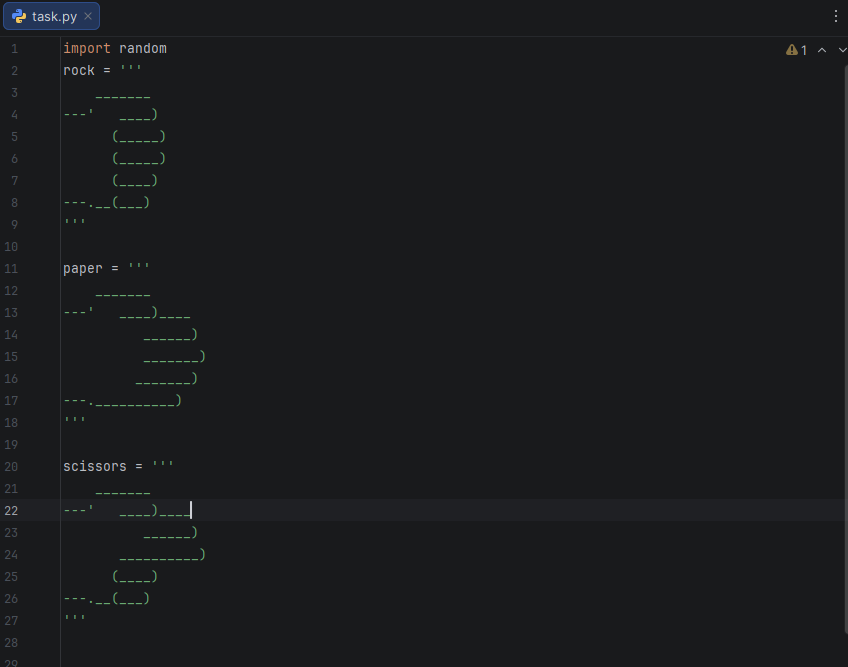
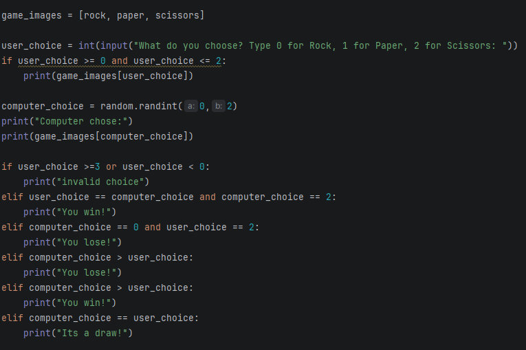

# Rock Paper Scissors Game

A simple command-line Rock, Paper, Scissors game built in Python.

👤 Author: Bao Luong
📧 Email: baodevops21@gmail.com

## Overview

This project allows a user to play Rock, Paper, Scissors against a computer opponent. The computer randomly selects its move, and the game determines the winner based on standard game rules.

This project was created as part of my Python learning journey to strengthen my understanding of:

- Lists
- User input
- Conditional logic
- Random number generation
- Basic game development concepts

## Features

- ✅ User selects Rock, Paper, or Scissors
- ✅ Computer generates a random move
- ✅ ASCII art display for each choice
- ✅ Win/Lose/Draw logic
- ✅ Input validation

## Technologies Used

- Python 3
- Random Module

## Screenshots

### Code



### Program Output



## How to Run

### Clone the repository

```bash
git clone https://github.com/cloud-by-bao/python-rock-paper-scissors.git
```

### Navigate into the project

```bash
cd python-rock-paper-scissors
```

### Run the application

```bash
python task.py
```

## Example

```text
What do you choose?
Type 0 for Rock, 1 for Paper, 2 for Scissors:

1

Computer chose:
Rock

You win!
```

## Skills Demonstrated

- Python Lists
- Nested Data Structures
- Conditional Statements
- User Input Handling
- Random Number Generation
- Command-Line Applications
- Debugging and Testing

## Future Improvements

- Best-of-three mode
- Score tracking
- Play-again option
- Refactor into functions
- Unit testing with pytest
- GUI version using Tkinter

- LinkedIn: https://www.linkedin.com/in/bluong21/
- GitHub: https://github.com/cloud-by-bao
